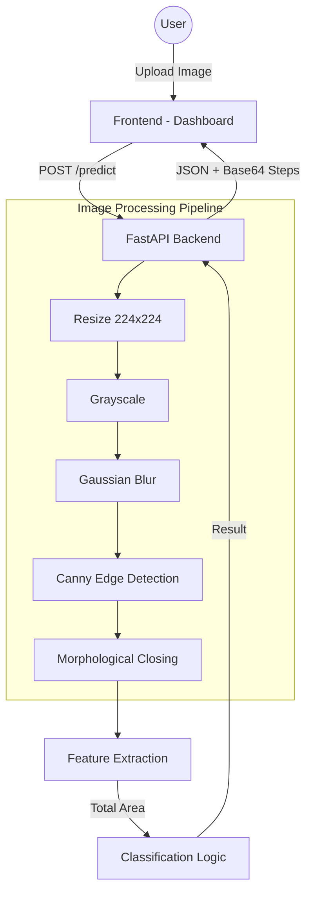

# Crack Detective AI 🚀

Sistem deteksi retakan pada permukaan menggunakan pengolahan citra digital berbasis **FastAPI** dan **OpenCV**. Proyek ini menyediakan API dan antarmuka web untuk menganalisis gambar retakan secara real-time.

## 🏗️ Arsitektur Sistem

Sistem ini dibangun dengan arsitektur modular yang memisahkan logika pemrosesan gambar, ekstraksi fitur, dan klasifikasi.



## 🛠️ Stack Teknologi

-   **Backend**: FastAPI (Python)
-   **Image Processing**: OpenCV, NumPy
-   **Frontend**: HTML5, CSS3 (Glassmorphism), JavaScript (Vanilla)
-   **Server**: Uvicorn

## 🚀 Instalasi & Cara Menjalankan

1.  **Clone Repository**
    ```bash
    git clone <repository-url>
    cd crack_detection
    ```

2.  **Install Dependencies**
    Pastikan Anda sudah memiliki Python 3.8+.
    ```bash
    pip install -r requirements.txt
    ```

3.  **Jalankan Server**
    ```bash
    uvicorn app:app --reload
    ```

4.  **Akses Aplikasi**
    Buka browser dan akses `http://127.0.0.1:8000` (atau port yang tertera di terminal).

## 🔌 Dokumentasi API

### 1. Predict (POST)
Menganalisis gambar dan memberikan hasil klasifikasi.

-   **Endpoint**: `/predict`
-   **Method**: `POST`
-   **Body**: `multipart/form-data`
    -   `image`: File gambar (JPG/PNG)

**Contoh Response:**
```json
{
  "status": "success",
  "prediction": "HEAVY CRACK",
  "details": {
    "total_area": 1250.5,
    "total_perimeter": 3450.2,
    "crack_count": 3
  },
  "steps": {
    "original": "base64_string...",
    "resized": "base64_string...",
    "grayscale": "base64_string...",
    "blurred": "base64_string...",
    "canny": "base64_string...",
    "binary": "base64_string..."
  }
}
```

### 2. Dashboard (GET)
Menampilkan antarmuka web.

-   **Endpoint**: `/`
-   **Method**: `GET`

## 📊 Pipeline Pemrosesan

1.  **Resize**: Menyeragamkan ukuran gambar ke 224x224 piksel.
2.  **Grayscale**: Mengonversi gambar ke skala abu-abu.
3.  **Gaussian Blur**: Menghilangkan noise/gangguan kecil pada gambar.
4.  **Canny Edge**: Mendeteksi tepi/garis yang berpotensi sebagai retakan.
5.  **Morphology**: Menutup celah kecil pada garis retakan agar kontur lebih solid.
6.  **Feature Extraction**: Menghitung luas area kontur yang valid (Area > 30).
7.  **Classification**: Mengkategorikan tingkat keparahan berdasarkan total area:
    -   `< 10`: NON CRACK
    -   `< 300`: LIGHT CRACK
    -   `< 700`: MEDIUM CRACK
    -   `> 700`: HEAVY CRACK

## 📂 Struktur Folder
```text
crack_detection/
├── src/
│   ├── preprocessing.py      # Logika filter & pemrosesan
│   ├── feature_extraction.py # Hitung kontur & area
│   └── classification.py     # Logika kategori retakan
├── templates/
│   └── index.html            # Frontend Dashboard
├── app.py                    # Entry point FastAPI
├── requirements.txt          # Daftar library
└── README.md                 # Dokumentasi ini
```
