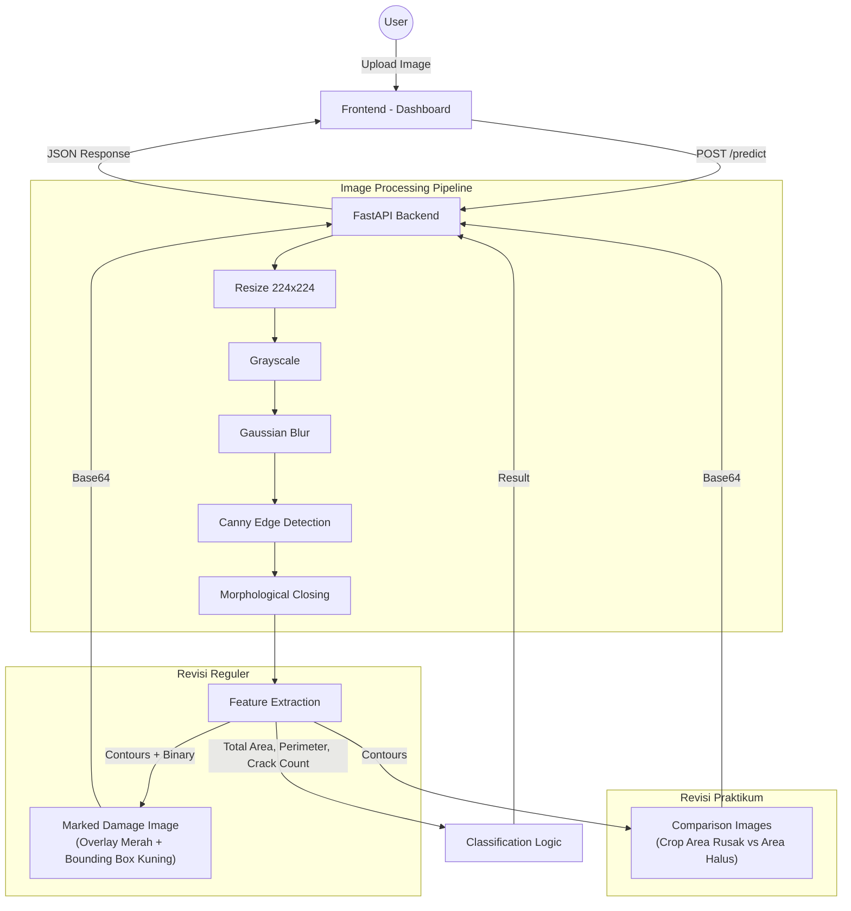

# Crack Detective AI 🚀

Sistem deteksi retakan pada permukaan tembok menggunakan pengolahan citra digital berbasis **FastAPI** dan **OpenCV**. Proyek ini menyediakan API dan antarmuka web untuk menganalisis gambar retakan secara real-time, lengkap dengan fitur **penandaan area kerusakan** dan **perbandingan area tembok rusak vs halus**.

---

## 🏗️ Arsitektur Sistem

Sistem ini dibangun dengan arsitektur modular yang memisahkan logika pemrosesan gambar, ekstraksi fitur, klasifikasi, serta dua fitur hasil revisi: penandaan kerusakan dan perbandingan area tembok.


```mermaid
graph TD
    User((User)) -->|Upload Image| WebUI[Frontend - Dashboard]
    WebUI -->|POST /predict| API[FastAPI Backend]
    
    subgraph "Image Processing Pipeline"
        API --> P1[Resize 224x224]
        P1 --> P2[Grayscale]
        P2 --> P3[Gaussian Blur]
        P3 --> P4[Canny Edge Detection]
        P4 --> P5[Morphological Closing]
    end
    
    P5 --> FE[Feature Extraction]
    FE -->|Total Area, Perimeter, Crack Count| CL[Classification Logic]
    
    subgraph "Revisi Reguler"
        FE -->|Contours + Binary| MD["Marked Damage Image<br/>(Overlay Merah + Bounding Box Kuning)"]
    end

    subgraph "Revisi Praktikum"
        FE -->|Contours| CP["Comparison Images<br/>(Crop Area Rusak vs Area Halus)"]
    end
    
    CL -->|Result| API
    MD -->|Base64| API
    CP -->|Base64| API
    API -->|JSON Response| WebUI
```

---

## 🛠️ Stack Teknologi

| Kategori | Teknologi |
| --- | --- |
| **Backend** | FastAPI (Python) |
| **Image Processing** | OpenCV, NumPy |
| **Frontend** | HTML5, CSS3 (Glassmorphism + 3D Tilt), Vanilla JavaScript |
| **Templating** | Jinja2 |
| **Server** | Uvicorn |
| **Font** | Google Fonts – Outfit |
| **Deployment** | Vercel |

---

## 🚀 Instalasi & Cara Menjalankan

1.  **Clone Repository**
    ```bash
    git clone https://github.com/Deikazen/pcd-model-API.git
    cd pcd-model-API
    ```

2.  **Buat Virtual Environment** (opsional, tapi disarankan)
    ```bash
    python -m venv venv
    # Windows:
    venv\Scripts\activate
    # Linux/Mac:
    source venv/bin/activate
    ```

3.  **Install Dependencies**
    Pastikan Anda sudah memiliki Python 3.8+.
    ```bash
    pip install -r requirements.txt
    ```

4.  **Jalankan Server**
    ```bash
    uvicorn app:app --reload
    ```

5.  **Akses Aplikasi**
    Buka browser dan akses `http://127.0.0.1:8000` (atau port yang tertera di terminal).

---

## ☁️ Deployment ke Vercel

Sistem ini siap di-deploy ke Vercel:

1.  **Gunakan OpenCV Headless**: Pastikan `requirements.txt` menggunakan `opencv-python-headless` (sudah dikonfigurasi).
2.  **Konfigurasi**: File `vercel.json` sudah disediakan untuk mengatur routing ke FastAPI.
3.  **Langkah Deployment**:
    -   Push kode Anda ke GitHub.
    -   Hubungkan repository ke Vercel Dashboard.
    -   Vercel akan mendeteksi `vercel.json` dan melakukan build otomatis.

> [!IMPORTANT]
> Vercel memiliki limit ukuran request (4.5MB). Pastikan gambar yang di-upload tidak melebihi batas tersebut.

---

## 🔌 Dokumentasi API

### 1. Predict (POST)
Menganalisis gambar dan memberikan hasil klasifikasi, tanda kerusakan, dan perbandingan area.

-   **Endpoint**: `/predict`
-   **Method**: `POST`
-   **Body**: `multipart/form-data`
    -   `image`: File gambar (JPG/PNG/JPEG)

**Contoh Response:**
```json
{
  "status": "success",
  "prediction": "HEAVY CRACK",
  "details": {
    "total_area": 1250.5,
    "total_perimeter": 3450.2,
    "crack_count": 3,
    "crack_percentage": 2.49
  },
  "steps": {
    "original": "base64_string...",
    "resized": "base64_string...",
    "grayscale": "base64_string...",
    "blurred": "base64_string...",
    "canny": "base64_string...",
    "binary": "base64_string...",
    "marked": "base64_string...",
    "damaged_crop": "base64_string...",
    "smooth_crop": "base64_string..."
  }
}
```

**Keterangan field `steps`:**

| Key | Deskripsi |
| --- | --- |
| `original` | Gambar asli yang di-upload |
| `resized` | Gambar setelah di-resize ke 224×224 |
| `grayscale` | Gambar setelah konversi ke skala abu-abu |
| `blurred` | Gambar setelah Gaussian Blur |
| `canny` | Gambar setelah Canny Edge Detection |
| `binary` | Gambar setelah Morphological Closing (binary) |
| `marked` | **(Revisi Reguler)** Gambar dengan overlay merah pada retakan + bounding box kuning |
| `damaged_crop` | **(Revisi Praktikum)** Crop area terdeteksi rusak/retak |
| `smooth_crop` | **(Revisi Praktikum)** Crop area halus/normal sebagai pembanding |

### 2. Dashboard (GET)
Menampilkan antarmuka web.

-   **Endpoint**: `/`
-   **Method**: `GET`

---

## 📊 Pipeline Pemrosesan

1.  **Resize**: Menyeragamkan ukuran gambar ke 224×224 piksel.
2.  **Grayscale**: Mengonversi gambar ke skala abu-abu.
3.  **Gaussian Blur**: Menghilangkan noise/gangguan kecil pada gambar menggunakan kernel 3×3.
4.  **Canny Edge Detection**: Mendeteksi tepi/garis menggunakan metode Otsu untuk threshold otomatis.
5.  **Morphological Closing**: Menutup celah kecil pada garis retakan agar kontur lebih solid menggunakan kernel 3×3.
6.  **Feature Extraction**: Menghitung luas area, perimeter kontur yang valid (Area > 30), dan **persentase kerusakan** (rasio area retakan terhadap total area gambar).
7.  **Damage Marking** *(Revisi Reguler)*: Menandai area kerusakan dengan overlay merah dan *bounding box* kuning.
8.  **Comparison Images** *(Revisi Praktikum)*: Menghasilkan crop area rusak dan crop area halus untuk perbandingan visual.
9.  **Classification**: Mengkategorikan tingkat keparahan berdasarkan total area:

| Total Area | Klasifikasi |
| --- | --- |
| `< 10` | NON CRACK |
| `< 300` | LIGHT CRACK |
| `< 700` | MEDIUM CRACK |
| `≥ 700` | HEAVY CRACK |

---

## 📝 Catatan Revisi

Terdapat dua jenis revisi utama pada pengembangan sistem ini. Konsep revisi dibagi menjadi **Revisi Reguler** (penambahan fitur baru di luar praktikum) dan **Revisi Praktikum** (perbaikan/penambahan fitur yang berkaitan dengan tugas praktikum). Berikut penjelasan lengkap beserta kode yang diubah:

---

### 1. Revisi Reguler — Penandaan Area Kerusakan Tembok

**Konsep:** Menambahkan visualisasi penandaan area kerusakan pada gambar tembok. Area yang terdeteksi retakan akan diberi **overlay merah semi-transparan** pada piksel retakan dan **bounding box kuning** pada setiap kontur retakan yang valid.

**File yang direvisi:**

#### `app.py` — Fungsi `create_marked_damage_image()`

Fungsi baru ini menerima gambar asli (yang sudah di-resize), daftar kontur, dan binary image. Lalu membuat overlay merah pada area retakan dan menambahkan kotak kuning di sekeliling retakan.

```python
# ini revisian reguler, menambah tanda pada kerusakan tembok
def create_marked_damage_image(image, contours, binary_img):
    marked_image = image.copy()

    # Bikin overlay merah dari hasil binary
    red_overlay = marked_image.copy()
    red_overlay[binary_img > 0] = (0, 0, 255)

    # Gabungkan gambar asli dengan overlay merah (75% asli, 25% merah)
    marked_image = cv2.addWeighted(marked_image, 0.75, red_overlay, 0.25, 0)

    # Tetap tambahkan kotak kuning dari contour
    for contour in contours:
        area = cv2.contourArea(contour)

        if area > 30:
            x, y, w, h = cv2.boundingRect(contour)
            cv2.rectangle(marked_image, (x, y), (x + w, y + h), (0, 255, 255), 2)

    return marked_image
```

**Penjelasan kode:**
- `image.copy()` — Menyalin gambar agar gambar asli tidak berubah.
- `red_overlay[binary_img > 0] = (0, 0, 255)` — Semua piksel yang terdeteksi sebagai retakan (bernilai > 0 di binary image) diwarnai merah.
- `cv2.addWeighted(marked_image, 0.75, red_overlay, 0.25, 0)` — Mencampur gambar asli (75%) dengan overlay merah (25%) agar retakan terlihat jelas tanpa menutupi gambar asli sepenuhnya.
- `cv2.boundingRect(contour)` — Mengambil koordinat kotak pembatas dari setiap kontur retakan.
- `cv2.rectangle(...)` — Menggambar kotak kuning `(0, 255, 255)` dengan ketebalan 2 piksel di sekeliling area retakan.

#### `app.py` — Update Endpoint `/predict`

Endpoint dipanggil setelah preprocessing dan feature extraction untuk menghasilkan gambar marked:

```python
# Step tambahan: kasih tanda kerusakan pada gambar 
marked_img = create_marked_damage_image(img_resized, contours, binary_img)
```

Dan ditambahkan ke response JSON:

```python
"marked": encode_img(marked_img),
```

#### `templates/index.html` — Section Tanda Kerusakan (Card 04)

Ditambahkan card baru di dashboard untuk menampilkan hasil penandaan kerusakan:

```html
<div class="card tilt-card marked-card" id="markedSection">
    <div class="card-header">
        <span class="card-number">04</span>
        <div>
            <h2>Tanda Kerusakan Tembok</h2>
            <p>Revisi reguler: area kerusakan diberi garis dan kotak penanda.</p>
        </div>
    </div>

    <div class="marked-preview">
        <p id="markedPlaceholder">Hasil tanda kerusakan akan muncul di sini.</p>
        
    </div>

    <div class="legend-row">
        <span><b class="red-dot"></b> Garis merah: kontur retakan</span>
        <span><b class="yellow-dot"></b> Kotak kuning: area kerusakan</span>
    </div>
</div>
```

#### `static/script.js` — Fungsi `setMarkedImage()`

Fungsi JavaScript untuk menampilkan gambar marked dari response API:

```javascript
function setMarkedImage(data) {
  const marked = data.steps.marked || data.steps.binary || data.steps.canny;

  if (!marked) {
    markedPlaceholder.style.display = "block";
    markedPlaceholder.innerText = "Gambar tanda kerusakan belum tersedia.";
    return;
  }

  markedImage.src = "data:image/jpeg;base64," + marked;
  markedImage.style.display = "block";
  markedPlaceholder.style.display = "none";
  markedPreview.classList.add("has-image");
}
```

---

### 2. Revisi Praktikum — Perbandingan Area Rusak vs Area Halus

**Konsep:** Menambahkan fitur perbandingan visual antara **area tembok yang rusak/retak** dengan **area tembok yang halus/normal** dari gambar yang sama. Sistem secara otomatis mengambil (crop) area dengan retakan terbesar sebagai "area rusak" dan mengambil area lain yang jauh dari retakan sebagai "area halus" untuk dibandingkan.

**File yang direvisi:**

#### `app.py` — Fungsi `create_comparison_images()`

Fungsi baru yang menghasilkan dua gambar crop: area rusak dan area halus dari gambar yang sama.

```python
# ini revisi praktikum, menambah perbandingan kerusakan tembok
def create_comparison_images(image, contours):
    h, w = image.shape[:2]

    valid_contours = []
    for contour in contours:
        area = cv2.contourArea(contour)
        if area > 30:
            valid_contours.append(contour)

    # Kalau tidak ada retakan, pakai gambar original sebagai fallback
    if len(valid_contours) == 0:
        return image.copy(), image.copy()

    # Ambil contour terbesar sebagai area rusak utama
    largest_contour = max(valid_contours, key=cv2.contourArea)
    x, y, cw, ch = cv2.boundingRect(largest_contour)

    # Tambahin padding biar crop area rusak tidak terlalu mepet
    padding = 25
    x1 = max(x - padding, 0)
    y1 = max(y - padding, 0)
    x2 = min(x + cw + padding, w)
    y2 = min(y + ch + padding, h)

    damaged_crop = image[y1:y2, x1:x2].copy()

    # Area halus diambil dari bagian gambar yang jauh dari area retakan
    crop_w = x2 - x1
    crop_h = y2 - y1

    # Default ambil pojok kanan atas sebagai area halus
    sx1 = max(w - crop_w - 10, 0)
    sy1 = 10
    sx2 = min(sx1 + crop_w, w)
    sy2 = min(sy1 + crop_h, h)

    # Kalau area halus terlalu dekat dengan retakan, pindah ke pojok kiri bawah
    overlap_x = not (sx2 < x1 or sx1 > x2)
    overlap_y = not (sy2 < y1 or sy1 > y2)

    if overlap_x and overlap_y:
        sx1 = 10
        sy1 = max(h - crop_h - 10, 0)
        sx2 = min(sx1 + crop_w, w)
        sy2 = min(sy1 + crop_h, h)

    smooth_crop = image[sy1:sy2, sx1:sx2].copy()

    return damaged_crop, smooth_crop
```

**Penjelasan kode:**
- **Filter kontur valid** — Hanya kontur dengan area > 30 yang dianggap retakan, sisanya noise.
- **Fallback** — Jika tidak ada retakan terdeteksi, kedua crop menggunakan gambar asli.
- `max(valid_contours, key=cv2.contourArea)` — Mengambil retakan terbesar sebagai fokus utama area rusak.
- `cv2.boundingRect()` — Mendapatkan bounding box dari retakan terbesar.
- **Padding 25px** — Menambahkan ruang di sekitar area rusak agar crop tidak terlalu mepet ke tepi retakan.
- `max()` dan `min()` — Memastikan koordinat crop tidak keluar dari batas gambar.
- **Strategi area halus** — Pertama coba ambil dari pojok kanan atas. Jika overlap (terlalu dekat) dengan area rusak, pindah ke pojok kiri bawah. Ini memastikan area halus benar-benar jauh dari retakan.
- **Deteksi overlap** — Menggunakan logika geometri untuk mengecek apakah dua area saling tumpang tindih pada sumbu X dan Y.

#### `app.py` — Update Endpoint `/predict`

Endpoint memanggil fungsi comparison dan menambahkan hasilnya ke response:

```python
# ini revisi praktikum, membandingkan kerusakan tembok dengan area halus
damaged_crop, smooth_crop = create_comparison_images(img_resized, contours)
```

Ditambahkan ke response JSON:

```python
"damaged_crop": encode_img(damaged_crop),
"smooth_crop": encode_img(smooth_crop)
```

#### `templates/index.html` — Section Perbandingan Area Tembok (Card 02)

Ditambahkan card baru di dashboard yang menampilkan perbandingan side-by-side antara area rusak dan area halus, lengkap dengan informasi statistik:

```html
<div class="card tilt-card comparison-card">
    <div class="card-header">
        <span class="card-number">02</span>
        <div>
            <h2>Perbandingan Area Tembok</h2>
            <p>Revisi praktikum: membandingkan area rusak dan area halus dari gambar yang sama.</p>
        </div>
    </div>

    <div class="comparison-grid enhanced">
        <!-- Kolom Kiri: Area Rusak -->
        <div class="compare-box damaged">
            <span class="compare-label">Area Rusak / Retak</span>
            <div class="compare-image">
                <p id="damagedPlaceholder">Area rusak akan muncul setelah analisis.</p>
                
            </div>
            <div class="compare-info">
                <div class="info-row">
                    <span>Status</span>
                    <strong id="damagedStatus">Belum dianalisis</strong>
                </div>
                <div class="info-row">
                    <span>Area Kerusakan</span>
                    <strong id="damagedArea">0.00</strong>
                </div>
                <div class="info-row">
                    <span>Jumlah Contour</span>
                    <strong id="damagedContour">0</strong>
                </div>
            </div>
        </div>

        <!-- Kolom Kanan: Area Halus -->
        <div class="compare-box smooth">
            <span class="compare-label">Area Halus / Normal</span>
            <div class="compare-image">
                <p id="smoothPlaceholder">Area halus akan muncul setelah analisis.</p>
                
            </div>
            <div class="compare-info">
                <div class="info-row"><span>Status</span><strong class="normal-text">Pembanding Normal</strong></div>
                <div class="info-row"><span>Area Kerusakan</span><strong>0.00</strong></div>
                <div class="info-row"><span>Jumlah Contour</span><strong>0</strong></div>
            </div>
        </div>
    </div>

    <div class="comparison-summary" id="comparisonSummary">
        Upload gambar terlebih dahulu untuk melihat perbandingan area rusak dan area halus.
    </div>
</div>
```

#### `static/script.js` — Fungsi `updateComparisonInfo()`

Fungsi JavaScript yang menampilkan gambar crop dan mengupdate statistik di card perbandingan:

```javascript
function updateComparisonInfo(data) {
  const prediction = data.prediction;
  const area = Number(data.details.total_area);
  const contour = Number(data.details.crack_count);

  // Tampilkan gambar area rusak dari response
  if (data.steps && data.steps.damaged_crop && damagedWallImage && damagedPlaceholder) {
    damagedWallImage.src = "data:image/jpeg;base64," + data.steps.damaged_crop;
    damagedWallImage.style.display = "block";
    damagedPlaceholder.style.display = "none";
  }

  // Tampilkan gambar area halus dari response
  if (data.steps && data.steps.smooth_crop && smoothWallImage && smoothPlaceholder) {
    smoothWallImage.src = "data:image/jpeg;base64," + data.steps.smooth_crop;
    smoothWallImage.style.display = "block";
    smoothPlaceholder.style.display = "none";
  }

  // Update statistik area rusak
  if (damagedStatus) damagedStatus.textContent = prediction;
  if (damagedArea) damagedArea.textContent = area.toLocaleString(undefined, {
    minimumFractionDigits: 2, maximumFractionDigits: 2
  });
  if (damagedContour) damagedContour.textContent = contour;

  // Update teks kesimpulan perbandingan
  if (comparisonSummary) {
    comparisonSummary.classList.add("active");
    comparisonSummary.innerText =
      `Perbandingan ini mengambil dua area dari gambar yang sama. ` +
      `Area kiri adalah bagian yang terdeteksi rusak/retak dengan total area ` +
      `${area.toFixed(2)} dan ${contour} contour. ` +
      `Area kanan adalah bagian tembok yang digunakan sebagai pembanding area halus/normal.`;
  }
}
```

---

### 3. Revisi Praktikum Sebelumnya — Perbaikan Bug Penanganan Data

**Konsep:** Memperbaiki bug (error) saat penangkapan data akibat ketidakcocokan jumlah variabel (*unpacking error*) saat memanggil fungsi `preprocessing_image`. Fungsi `preprocessing_image` mengembalikan 6 nilai (`img, resized_img, gray, blur, canny, close`), namun pemanggil hanya menangkap 5 variabel sehingga menyebabkan error.

**File yang direvisi:**

#### `src/main.py` — Penambahan variabel `binary_image`

```python
# Sebelum revisi (ERROR - hanya 5 variabel):
img, gray, blur, canny, close = preprocessing_image(image_path)

# Sesudah revisi (6 variabel sesuai return value):
img, gray, blur, canny, close, binary_image = preprocessing_image(image_path)
```

#### `test.py` — Penyesuaian parameter variabel

```python
# Sebelum revisi (ERROR):
img_original, gray, blur, canny, close = preprocessing_image(path)

# Sesudah revisi:
img_original, gray, blur, canny, binary_img, close = preprocessing_image(path)
```

#### `src/feature_extraction.py` — Pembersihan komentar usang

Menghapus sisa komentar lama tentang logika *circularity* yang tidak lagi relevan.

#### `src/preprocessing.py` — Pembersihan komentar usang

Menghapus sisa komentar untuk filter bilateral yang sudah tidak digunakan.

---

## 🎨 Fitur Antarmuka Web (Dashboard)

Dashboard web terdiri dari 5 section utama:

| No. | Section | Deskripsi |
| --- | --- | --- |
| 01 | **Upload Image** | Area drag & drop atau klik untuk upload gambar tembok. Dilengkapi animasi 3D wall dan scan line. |
| 02 | **Perbandingan Area Tembok** *(Revisi Praktikum)* | Menampilkan perbandingan side-by-side area rusak vs area halus dengan statistik (status, area, jumlah contour). |
| 03 | **Analysis Result** | Menampilkan hasil klasifikasi (NON/LIGHT/MEDIUM/HEAVY CRACK) beserta **persentase kerusakan** dengan warna dan statistik yang teranimasi. |
| 04 | **Tanda Kerusakan Tembok** *(Revisi Reguler)* | Menampilkan gambar dengan overlay merah pada retakan dan bounding box kuning di sekeliling area kerusakan. |
| 05 | **Preprocessing Pipeline** | Visualisasi 5 tahap preprocessing: Resized → Grayscale → Blur → Canny → Binary. |

### Fitur UI Tambahan:
- **Glassmorphism** — Efek kaca buram pada card.
- **3D Tilt Effect** — Card bergerak mengikuti posisi cursor mouse.
- **Cursor Glow** — Efek cahaya yang mengikuti gerakan cursor.
- **Floating Orbs** — Animasi background yang bergerak mengambang.
- **Scan Line Animation** — Animasi scanning saat gambar sedang dianalisis.
- **Number Animation** — Angka statistik terangmasi dari 0 ke nilai akhir.
- **Responsive Design** — Tampilan menyesuaikan layar desktop, tablet, dan mobile.

---

## 📂 Struktur Folder

```text
pcd-model-API/
├── src/
│   ├── __init__.py              # Init module
│   ├── preprocessing.py         # Pipeline filter & pemrosesan gambar
│   ├── feature_extraction.py    # Hitung kontur, area, perimeter, circularity
│   ├── classification.py        # Logika kategori retakan (4 level)
│   └── main.py                  # Script testing manual (CLI)
├── static/
│   ├── script.js                # Logika interaksi frontend (upload, result, comparison)
│   ├── style.css                # Styling antarmuka web (glassmorphism, 3D tilt, dll)
│   └── images/                  # Aset gambar untuk web
├── templates/
│   └── index.html               # Frontend Dashboard (Jinja2 template)
├── dataset/
│   ├── positive/                # Gambar tembok dengan retakan
│   └── negative/                # Gambar tembok tanpa retakan
├── app.py                       # Entry point FastAPI + fungsi revisi
├── demo.py                      # Demo interaktif distribusi Gaussian (Matplotlib)
├── test.py                      # Script testing batch (dataset positive & negative)
├── test_api.py                  # Script testing API endpoint
├── requirements.txt             # Daftar library Python
├── vercel.json                  # Konfigurasi deployment Vercel
├── .gitignore                   # File yang diabaikan Git
├── .pylintrc                    # Konfigurasi linter Python
└── README.md                    # Dokumentasi ini
```

---

## 📋 Dependencies

```
opencv-python-headless
numpy
matplotlib
fastapi
uvicorn
jinja2
python-multipart
```

---

## 👤 Author

**Deikazen** — [GitHub](https://github.com/Deikazen)
